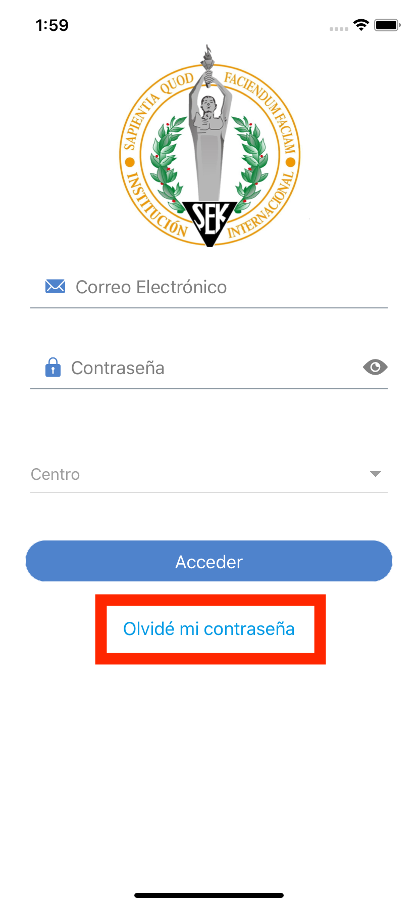

# SEK2020 App
En este tutorial se explican los pasos para el uso básico de la aplicación SEK2020.

## Primera vez
Para la primera vez que se acceda a la app es necesario generar una contraseña. Para esto basta con hacer click en _Olvidé mi contraseña_, bajo el botón de acceso en la pantalla de login:

Después debe indicar la dirección de email asociada con su usuario y el centro. Esta coincidirá con la que facilitó al colegio para comunicaciones. Si no está seguro de cuál es, puede consultarlo en el colegio.

Una vez haga click en _Recuperar contraseña_, si el email está asociado al centro selccionado, verá un popup indicando que se le ha enviado un correo electrónico con las instrucciones para elegir o cambiar su contraseña. 

Al seguir el enlace se le pedirá que elija su nueva contraseña.

Una vez elegida la contraseña, puede volver a abrir la aplicación y usar su email y la contraseña que eligió para iniciar sesión, siempre, indicando el centro.

## Una vez dentro
Podrá leer y escribir mensajes a los tutores de su(s) hijo(s). El funcionamiento es muy similar al de una aplicación de lectura de emails.

